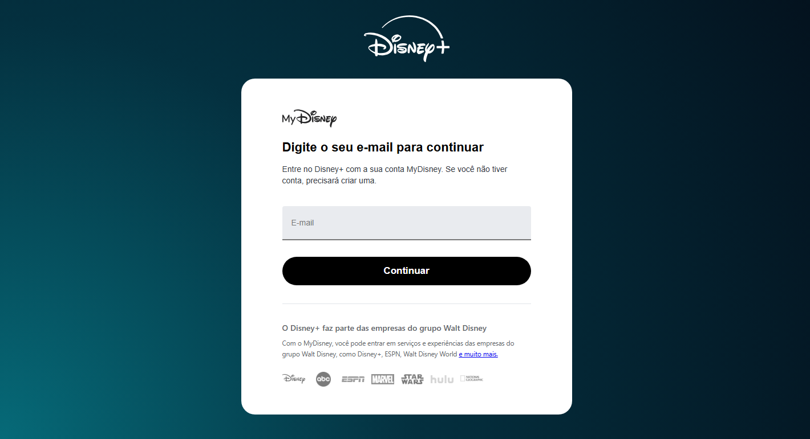
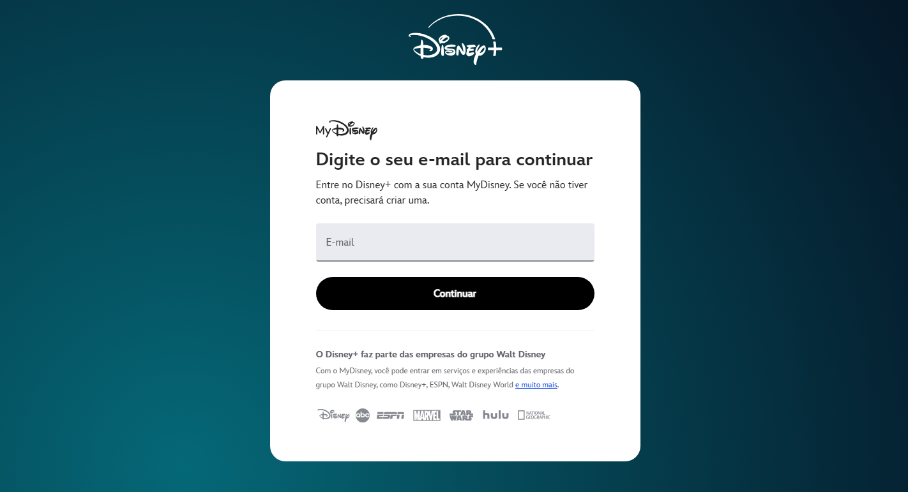

# Clone Disney+ — Trabalho G1 Front-End

**Nome:** Lucas A. C. Castelli  
**RA:** 1139217  
**Disciplina:** Front-End  
**Professor:** Matheus Henrique Barquette  
**Período:** G1

## Site de referência

https://www.disneyplus.com/identity/login/enter-email

## Sobre o projeto

Este repositório contém a reprodução estática, em HTML e CSS, da tela de login/e-mail do Disney+. O objetivo é demonstrar domínio de HTML semântico, CSS (seletores, box model, variáveis) e responsividade mobile first, conforme especificado no trabalho da disciplina.

## Checklist — Parte 1

### 1.1 Estrutura HTML semântica e acessível
- [x] Uso de tags semânticas (`header`, `main`, `section`, `footer`) refletindo a estrutura da página.
- [x] Todas as imagens possuem atributo `alt` descritivo.
- [x] Formulário acessível: campo de e-mail com `label` associado (oculto visualmente via classe `.sr-only`, mantendo o `placeholder` como referência visual e o `label` disponível para leitores de tela).

### 1.2 Fidelidade visual à referência escolhida
- [x] Proporções, espaçamentos, cores e tipografia reproduzidos com base na página original do Disney+.
- [x] Mesma organização geral: cabeçalho com logo, conteúdo central (formulário) e rodapé com links institucionais.
- [x] Diferenças assumidas:
  - Fonte: o site original do Disney+ usa uma fonte proprietária; no clone foi utilizada `Arial` (textos gerais) e `system-ui` (rodapé), por serem fontes de sistema, sem custo de licença.
  - Ícones/logos das empresas do grupo (Marvel, ESPN, Star Wars, etc.) foram reproduzidos com imagens estáticas (`.webp`/`.png`/`.svg`) ao invés de sprites/SVGs otimizados usados pelo site real.

### 1.3 CSS: seletores, box model e variáveis
- [x] Uso de pelo menos três tipos de seletor diferentes:
  - Seletor de classe (`.meu-botao`, `.rodape`)
  - Seletor descendente (`section p`, `.rodape a`)
  - Pseudo-classe (`.meu-botao:hover`)
- [x] Uso de variáveis CSS (`--cor-fundo-inicio`, `--cor-fundo-meio`, `--cor-fundo-fim`) aplicadas no `background` do `body`.

### 1.4 Responsividade: Flexbox, Grid e mobile first
- [x] CSS escrito mobile first, funcional sem media query.
- [x] Uso de Flexbox (`.logos`, `.corfundoHeader`) e Grid (`.rodape`).
- [x] Media query `min-width: 768px` ajustando o layout para telas maiores.
- [x] Layout testado em tela de celular e desktop.

### 1.5 Personalização e originalidade
- [x] Trecho de personalização adicionado no rodapé (`.creditos-clone`), identificando o clone como projeto acadêmico com nome e RA do autor — conteúdo que não existe na página original do Disney+.

## Comparação visual (original x clone)

| Original | Clone |
|----------|-------|
|  ||

## Arquivos

- `index.html` — estrutura da página
- `style.css` — estilização
- `README.md` — este arquivo

## Pasta

- `assets` — guarda todas logos e foto da comparação